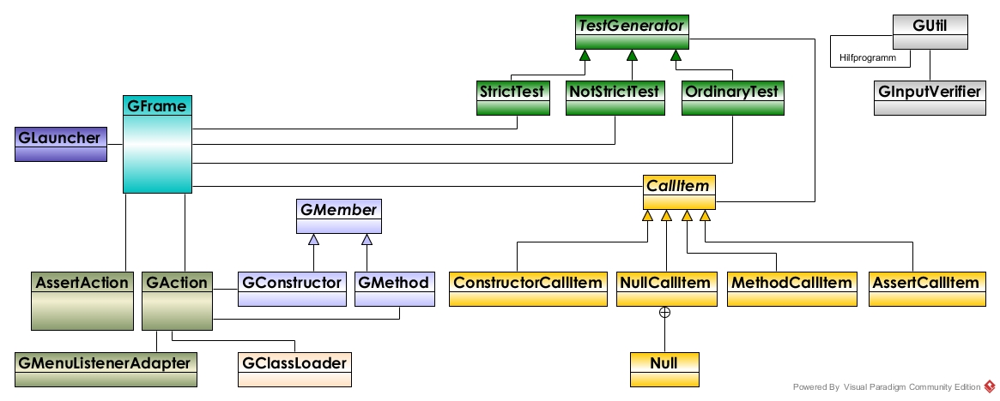
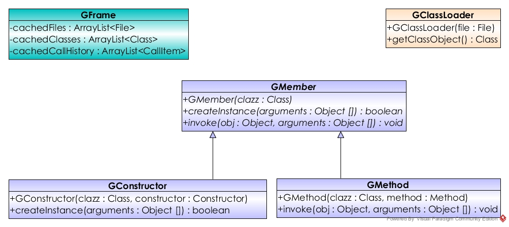
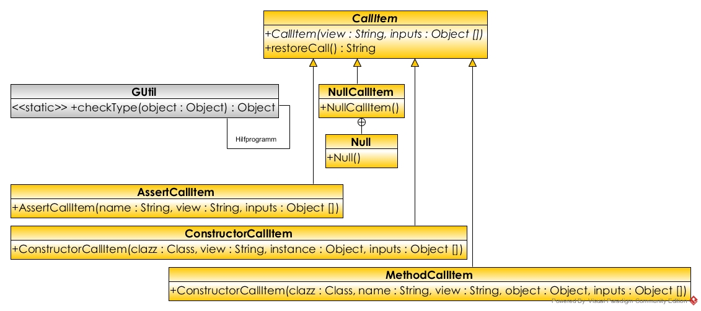
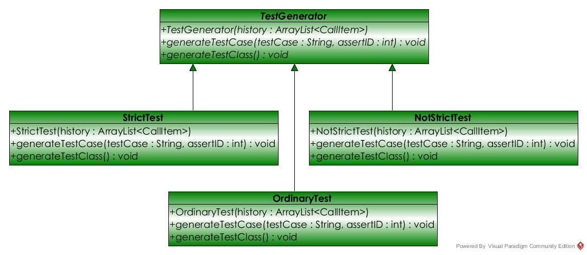
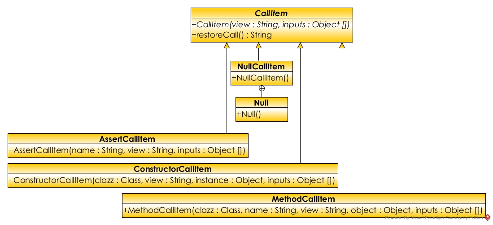

# generateur-de-tests-unitaires-za

Ce logiciel est une "proof of concept" qui vous permet de générer de facon interactive à partir d'une interface graphique des test unitaires pour vos classes Java. 

## Architecture du logiciel

## Configuration de l'environnement de travail

[Installer le Coding Pack for Java](https://code.visualstudio.com/docs/java/java-tutorial) qui inclut:
- Java Development Kit 14
- Visual Studio Code 1.78.2
- Java Extensions

Installer JDK à partir de [Eclipse Adoptium's Temurin](https://adoptium.net/)
